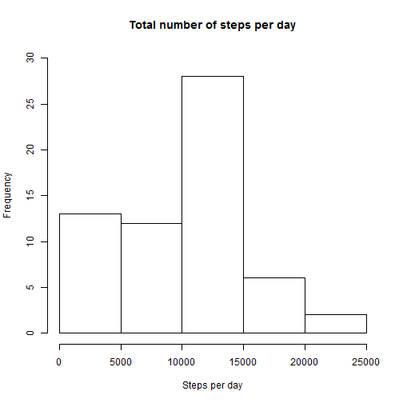
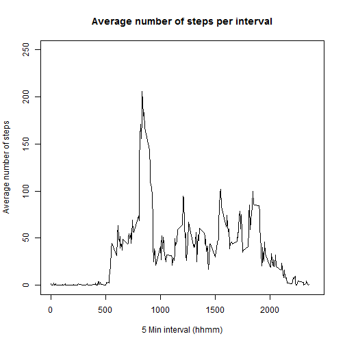
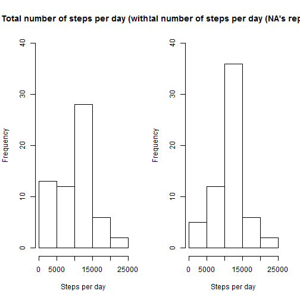
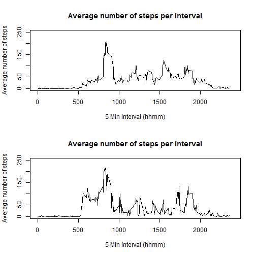

Reproducible Research: Peer Assessment 1

Lets first set global options and then read the file which you have unzipped


```r
activity <- read.csv("activity.csv")
```
Q1.  What is the mean total number steps taken per day?
This question can be anwered as follows: firstly the total number of steps should be calculated. This was done by means of tapply, using the 'dates' column (factor) as index and 'sum' as function. Next, the hist function is applied to create a histogram of the total number of staps taken per day.


```r
StepsPerDay <- tapply(activity$steps, activity$date, sum, na.rm = T)

hist(StepsPerDay, ylim = range(0:30), main = "Total number of steps per day", 
    xlab = "Steps per day", ylab = "Frequency")
```

 

Reporting the mean and median total number of steps taken per day


```r
print(mean_StepsPerDay <- mean(StepsPerDay))
```

```
## [1] 9354
```

```r
print(median_StepsPerDay <- median(StepsPerDay))
```

```
## [1] 10395
```


Q2. What is the average daily activity pattern?

To answer this question, first the average number of steps for each interval is calculated across all days by means of tapply. The resulting vector can be used to plot the average daily activity pattern.


```r
StepsPerInterval <- tapply(activity$steps, as.factor(activity$interval), mean, 
    na.rm = T)

plot(levels(as.factor(activity$interval)), StepsPerInterval, type = "l", xlab = "5 Min interval (hhmm)", 
    ylab = "Average number of steps", main = "Average number of steps per interval", 
    ylim = range(0:250), xlim = range(0:2400))
```

 


Which 5-minute interval, on average across all the days in the dataset, contains the maximum number of steps?


```r
names(StepsPerInterval)[which(StepsPerInterval == max(StepsPerInterval))]
```

```
## [1] "835"
```

Q3. Imputing missing values

There are a number of days/intervals where there are missing values (coded as NA). The presence of missing days may introduce bias into some calculations or summaries of the data. So how many values are missing in this dataset? The number of NA's can be calculated as follows:


```r
print(NumberOfNAs <- sum(is.na(activity$steps)))
```

```
## [1] 2304
```

To solve this problem, a strategy for filling in all of the missing values in the dataset is devised in order to craft a new dataset (activity_noNA) with the NA's replaced. The NA's are replaced by the mean of the respective 5 minute intervals across all days. This is done by the function replaceNA().


```r
replaceNA <- function() {

    activity_noNA <- activity

    for (i in 1:length(activity_noNA$steps)) {

        if (is.na(activity_noNA$steps[i])) {

            interval <- as.character(activity_noNA$interval[i])
            intervalmean <- StepsPerInterval[interval]

            activity_noNA$steps[i] <- intervalmean

        } else {
        }

    }

    activity_noNA <<- activity_noNA
}

source("replaceNA.R")
replaceNA()
```

To find out what the impact of missing values is, again a histogram is created, but now from the new activity data frame in which the NA's have just been replaced.

## First calculate the new total number of steps


```r
StepsPerDay_noNA <- tapply(activity_noNA$steps, activity_noNA$date, sum, na.rm = T)

## Set plotting space and fill with the two plots
par(mfcol = c(1, 2))

hist(StepsPerDay, ylim = range(0:40), main = "Total number of steps per day (with NA)", 
    xlab = "Steps per day", ylab = "Frequency")
hist(StepsPerDay_noNA, ylim = range(0:40), main = "Total number of steps per day (NA's replaced)", 
    xlab = "Steps per day", ylab = "Frequency")
```

 

We also see that the mean and median have changed significantly. Thus, we can conclude that the impact of missing values has certainly be proven in this assigment.


```r
print(paste("Mean:", (mean_StepsPerDay_noNA <- mean(StepsPerDay_noNA)), sep = " "))
```

```
## [1] "Mean: 10766.1886792453"
```

```r
print(paste("Median:", (median_StepsPerDay_noNA <- median(StepsPerDay_noNA)), 
    sep = " "))
```

```
## [1] "Median: 10766.1886792453"
```

Q.4 Are there differences in activity patterns between weekdays and weekends?

To find the answer to this question, first an extra column is added to the data frame activity_noNA, containing the text "weekday" for each measurement done on a weekday and the text "weekend" for each measurement done in the weekend. Therefore, first the date column is converted to the Date class, and the weekdays() function is applied to find out which days were weekdays or weekends. This column is converted to a factor, and the levels are renamed to prevent language problems. Subsequently gsub() is used to create labels for weekdays and weekends.


```r
activity_noNA$date <- as.character(activity_noNA$date)
activity_noNA$date <- as.Date(activity_noNA$date)

weekdays <- (weekdays(activity_noNA$date))

activity_noNA$weekdays <- as.factor(weekdays)

levels(activity_noNA$weekdays) <- c("weekday", "weekday", "weekday", "weekday", 
    "weekday", "weekend", "weekend")
```

Now a panel plot can be made to compare the activity patterns between weekdays and weekends. This is done in the base plotting system of R.


```r
which_weekdays <- activity_noNA$weekdays == "weekday"  ## subset weekday rows
which_weekends <- activity_noNA$weekdays == "weekend"  ## subset weekend rows

## Calculating average number of steps per interval across weekdays and
## weekends
StepsPerInterval_weekday <- tapply(activity_noNA$steps[which_weekdays], as.factor(activity$interval[which_weekdays]), 
    mean, na.rm = T)
StepsPerInterval_weekend <- tapply(activity_noNA$steps[which_weekends], as.factor(activity$interval[which_weekends]), 
    mean, na.rm = T)

## Plot results in panel plot
par(mfcol = c(2, 1))

plot(levels(as.factor(activity_noNA$interval)), StepsPerInterval_weekday, type = "l", 
    xlab = "5 Min interval (hhmm)", ylab = "Average number of steps", main = "Average number of steps per interval", 
    ylim = range(0:250), xlim = range(0:2400))

plot(levels(as.factor(activity_noNA$interval)), StepsPerInterval_weekend, type = "l", 
    xlab = "5 Min interval (hhmm)", ylab = "Average number of steps", main = "Average number of steps per interval", 
    ylim = range(0:250), xlim = range(0:2400))
```

 


